<!-- page_number: true -->
<!-- $size: 16:9 -->

# Node.js 101

> Out of browser, not only for web application but also using everywhere

---

# Understanding Node(.js)

- 공식적으로는 Node(node), 단어 혼동을 피하기 위해 Node.js
- [V8](https://en.wikipedia.org/wiki/V8_(JavaScript_engine)) 엔진(당분간)을 사용하는 그래서 Javascript 을 주언어로 사용
- (비교적) 가볍고, 빠르며, 다양한 환경에서 동작하는 프레임워크
- 비동기(Asynchronous) I/O via [libuv](https://github.com/libuv/libuv)
- 이벤트-드리븐(Event-driven) 그리고 넌블럭킹(Non-Blocking) I/O
- 엄청나게 활발한 커뮤니티의 은혜. [Node 파운데이션](https://nodejs.org/en/foundation/)과 [NPM Packages](http://www.modulecounts.com/)


---


## V8 Javascript Engine

- 기존 대비 월등한 성능을 보여주는 Javascript 엔진(인터프린터)
- 독립적으로 구현되어 다른 프로젝트와 결합 가능. Node.js, MongoDB, Electron 등
- [V8 엔진 업데이트](https://github.com/nodejs/node/pull/9697)와 함께 Javascript 의 여러가지 기능 추가. ES2015 추가 스펙 ([ECMAScript 2015 stage-x](https://github.com/tc39/proposals))
  - 2017 년 여러 엔진 사용가능 예상. (마이크로소프트 Edge 브라우저의 [ChakraCore](https://github.com/nodejs/node/pull/4765)) 

---

## High-performance for Low Resource Consumer


- (소시적에) 비교적 빠른 성능 보여줌 적은 리소스 사용
- 싱글 쓰레드에서 초당 수만건의 데이터 처리 만명 이상의 동시접속자 처리 가능 (라이트패킷)
- 다양한 (비교적 저사향) IoT 모듈에 임베디드
- V8 와 node를 위한 [내장](https://nodejs.org/en/docs/guides/simple-profiling/) / [외장](https://medium.com/@paul_irish/debugging-node-js-nightlies-with-chrome-devtools-7c4a1b95ae27#.mczayq4i0) 프로파일러 제공

----


## Asynchronous I/O via [libuv](https://github.com/libuv/libuv)

- 싱글 쓰레드에서 고성능 I/O 보장
- 멀티 플랫폼에서 안정적인 비동기 I/O 지원
- node 이벤트 루프의 [유니콘](https://www.youtube.com/watch?v=PNa9OMajw9w&feature=youtu.be&t=590)

----

## Event Loop for Event-driven APIs and Non-blocking I/O

> [Morning Keynote - Everything You Need to Know About Node.js Event Loop](https://www.youtube.com/watch?v=PNa9OMajw9w) - [Bert Belder](https://twitter.com/piscisaureus)

----

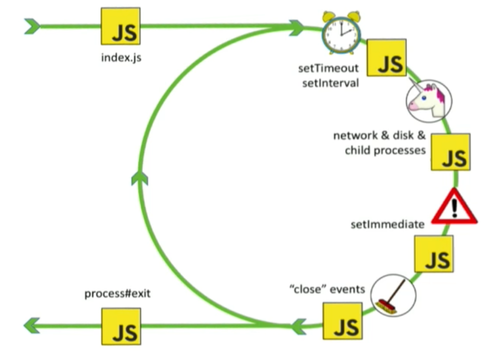

----

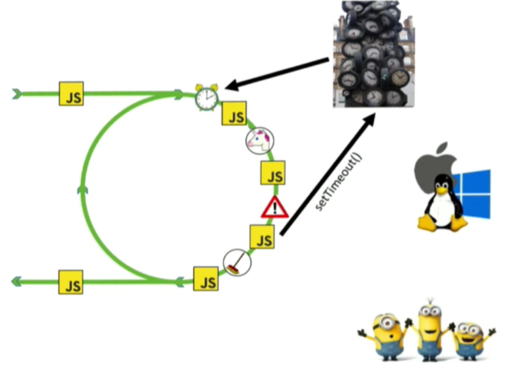

----

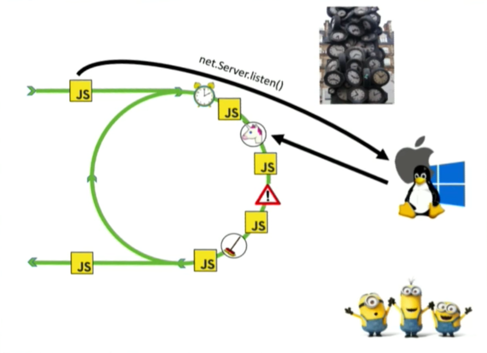

----

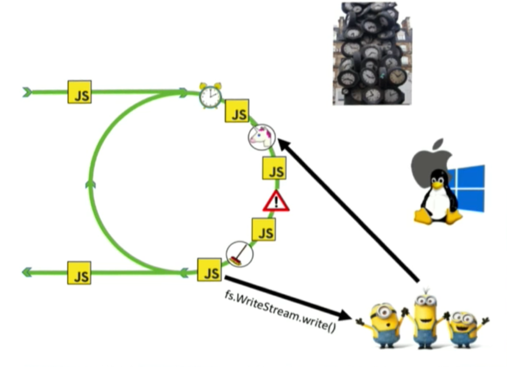

----

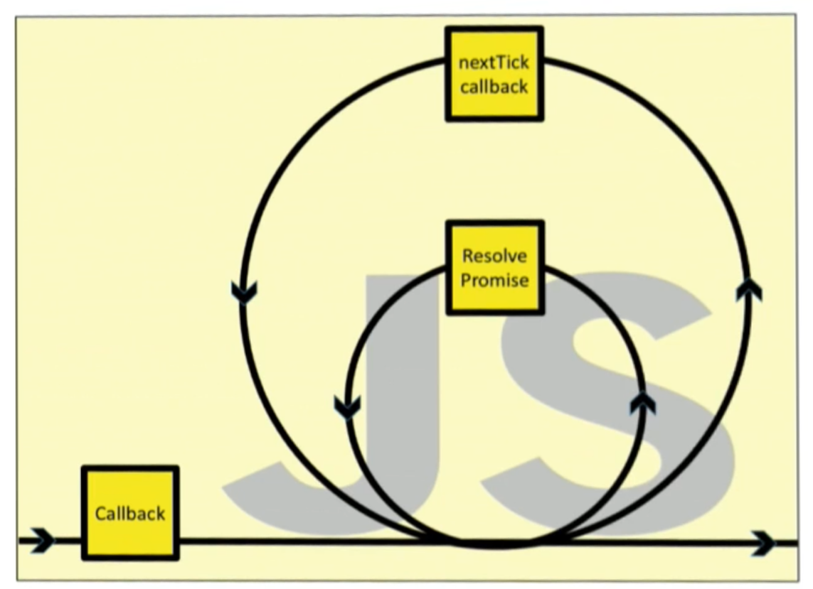

----

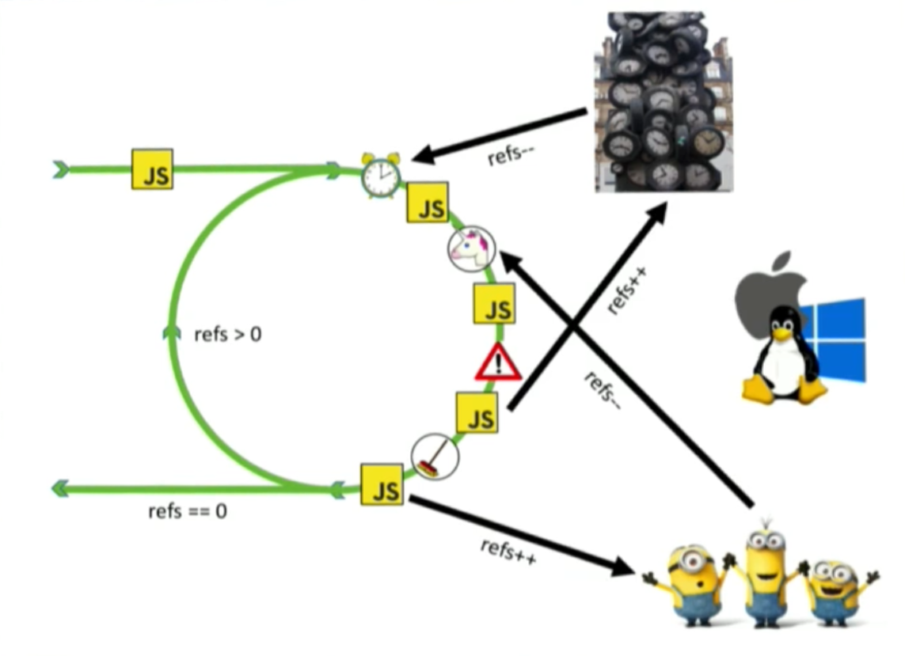

----

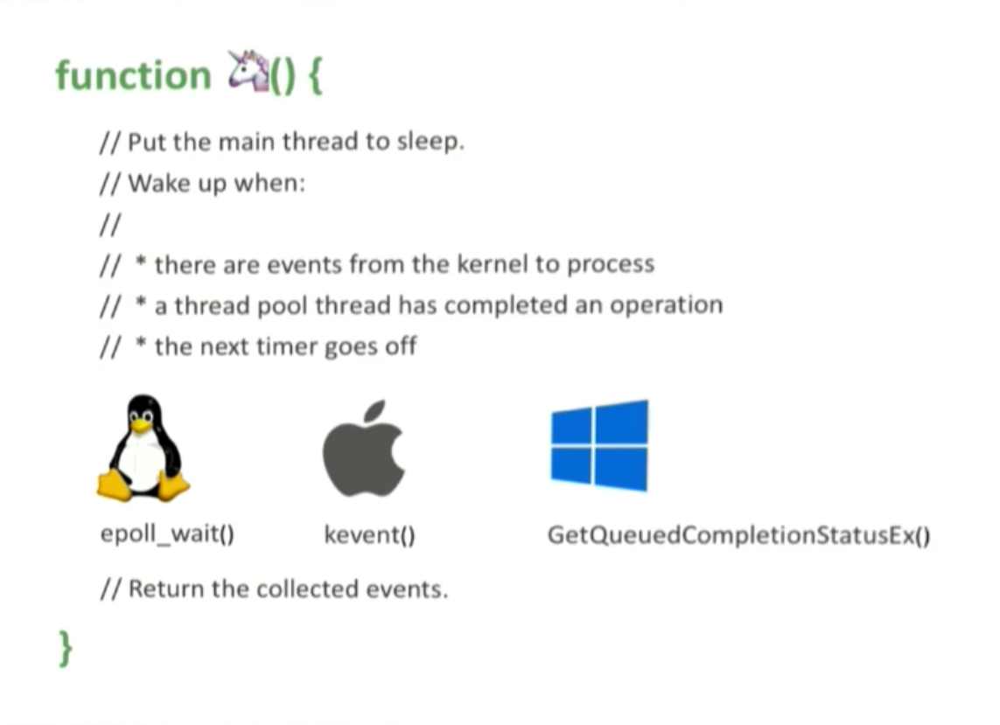

----

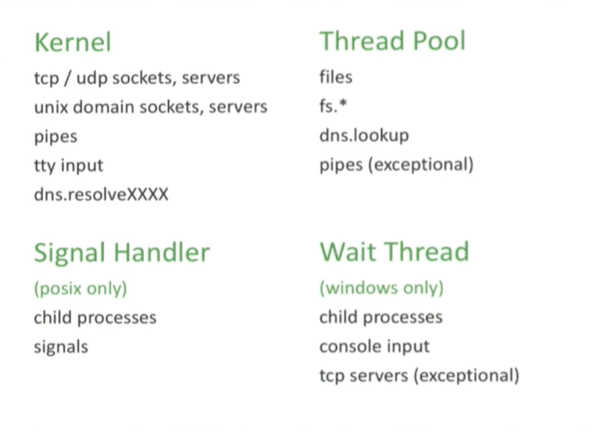

----


## Event Loop

```js
setImmediate(() => console.log("1"));
setTimeout(() => console.log("2"), 0);
Promise.resolve().then(() => console.log('3'));
setTimeout(() => console.log("4"), 0);
(() => console.log('5'))();
Promise.resolve().then(() => console.log('6'));
process.on('beforeExit', () => {
    console.log('7');
});
```

- Question?: 이벤트 일어나는 순서를 추측해보세요
  - 1: 3 5 6 1 2 4 7
  - 2: 5 3 6 1 2 4 7
  - 3: 3 5 6 2 4 1 7
  - 4: 5 3 6 2 4 1 7

----


## Open Source, Amazing Communities for Node

----

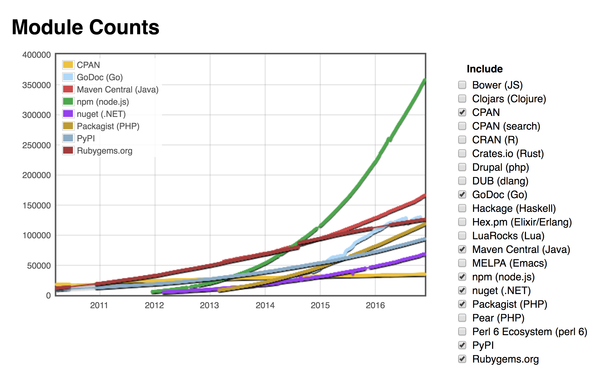

----

### [How many packages are downloaded?](http://blog.npmjs.org/post/143451680695/how-many-npm-users-are-there) A BILLION


----

# Getting Started Node

- [Node 6.9.x LTS 버전 기준](https://nodejs.org/dist/latest-v6.x/docs/api/)
  - https://github.com/nodejs/LTS#lts_schedule
- NVM 을 사용한 Node 설치
- Node 프로젝트 생성과 NPM 사용
- 기본 사용법
  - 모듈 (module) 로딩
  - 이벤트 처리: 콜백(Callback), 프라미스(Promise) 핸들링
  - 에러, 예외(Exception) 처리
  - 기본 API 사용법: Net / HTTP / File System / Stream

----

## Installing Node with [NVM](https://github.com/creationix/nvm)

```sh
# get versions can be installable
nvm ls-remote

# install node
nvm install v6.9.1
nvm install --lts

# get versions installed
nvm ls

# use a version
nvm use v6.9.1
```

----

## Setting up Projects by [NPM](https://www.npmjs.com/) / [yarn](https://github.com/yarnpkg/yarn)

> 대부분의 프로젝트는 여러 패키지를 설치해서 사용. 그 정보들을 [package.json](https://docs.npmjs.com/files/package.json) 에 저장

```sh
# init project
yarn init or npm init

# install packages of the project
yarn install or npm install

# install new package to depedencies
yarn add PACKAGE_NAME or npm install —save PACKAGE_NAME

# install new package to dev depedencies
yarn add --dev PACKAGE_NAME or npm install —save-dev PACKAGE_NAME

# run scripts
yarn start or npm start
yarn test or npm test
yarn run my-command or npm run my-command
```

---

## Module Importing(loading)

```js
// internal module
const fs = require('fs');

// installed module at node_modules
const lib = require('lib');

// user module
const foo = require('./foo');

// destructuring in ES2015
const {app} = require('electron');

// in a way of ES2015, not yet landing, using transfiler like babel.js
const electron, {app} import 'electron';
```

---

## Module Exporting

```js
// legacy, using node's modules system
module.exports = function lib() {
  return 'exported';
}

// ES2015, not yet landing, using transfiler like babel.js
export default function lib() {
  return 'exported in a new way';
}
```


---

## Event / Error Handling with Callback

- Callback 은 node 의 low-level APIs 에서 기본으로 사용되는 방법
- [Error First Callback](https://www.joyent.com/node-js/production/design/errors)


```js
const fs = require('fs');

fs.stat('.', (err, stats) => {
  if (err) {
    console.log(err);
    return;
  }

  console.log(stats);
});
```

---

## Event / Error Handling with Promise

```js
const fs = require('fs');

function fsStatPromise(path) {
  return new Promise((resolve, reject) => {
    fs.stat(path, (err, stats) => {
      if (err) {
        resject(err);
      }

      resolve(stats);
    });
  });
}

fsStatPromise('.').then(stats => {
  console.log(stats);
}).catch(err => {
  console.log(err);
});
```

---

## Custom Event Class with EventEmitter

```js
const EventEmitter = require('events');

class HTTP3 extends EventEmitter {
  request(msg) {
    if (!msg) { this.emit('request', new Error('no message')); return;}
    this.emit('request', null, msg);
  }
}

const http3 = new HTTP3();
http3.on('request', (err, msg) => {
  if (err) { throw err; }

  console.log('done with', msg);
});

http3.request('msg');
http3.request(); // will cause error
```

---

## Protips: Promisify a callback-style function


- Install
  ```js
  yarn add --dev pify
  ```
- How to use
  ```js
    const fs = require('fs');
    const pify = require('pify');

    const fsp = pify(fs);

    fsp.stat('.').then(stats => {
      console.log(stats);
    }).catch(err => {
      console.error(err);
    });
  ```

---

## Node APIs Using Exmples

- [Net](https://nodejs.org/dist/latest-v6.x/docs/api/net.html): Echo Server using TCP and telnet
- [HTTP](https://nodejs.org/dist/latest-v6.x/docs/api/http.html): Very simple http server. Say Hello!
- [Stream](https://nodejs.org/api/stream.html): Using stream in practice

---

### Net: Echo Server using TCP and telnet

```js
const net = require('net');
const server = net.createServer(s => {
  console.log('client connected');
  
  // handle closing connection
  s.on('end', () => {
    console.log('client disconnected');
  });
   
   // write welcome message
   s.write('hello\n\n');

   // echo message come from client
   s.pipe(s);

}).on('error', err => {
  throw err;
});

// to connect, telnet 0.0.0.0 8080
server.listen({ port: 8080 }, () => {
  console.log('Server has been started', server.address());
});
```

---

### HTTP: Very simple http server. Say Hello!

```js
const http = require('http');

const indexHTML = `<html><head></head><body><div>Hello</div></body></html>`;

const server = http.createServer((req, res) => {
  res.writeHead(200, {'Content-Type': 'text/html'});
  res.end(indexHTML);
});

server.on('clientError', (err, s) => {
  socket.end('HTTP/1.1 400 Bad Request\r\n\r\n');
});

// to view, type localhost:8080 on web browser or curl 0.0.0.0:8080
server.listen(8080, () => {
  console.log('Server has been started', server.address());
});
```
---

### Stream

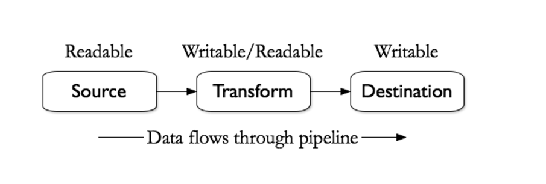

- node 에서 기본적(비동기적)으로 데이터를 주고 받는 방법
- 대용량 파일이나 네트웍에서 들어오는 데이터(Stream)를 처리하기 용이
  - TCP, HTTP requests / responses
  - fs write, zlib, crypto, streams
  - process.stdout, process.stderr, child process stdin
- Readable, Writable, [Duplex/Transform (both readable and writable)](https://nodejs.org/api/stream.html#stream_duplex_and_transform_streams)

----

#### Stream: Transform

- 기본적으로 사용하는 Stream, Duples (Readable / Writable)
- pipe() 를 한 연결처리(pipelining) 하지만 사용하기 구현하기 다소 귀찮음

```js
var stream = require('stream');
var liner = new stream.Transform( { objectMode: true } );
liner._transform = function (chunk, encoding, done) {
	// after processing
	done()
};
```
---

#### Protips: [through2](https://github.com/rvagg/through2)

- 실제 많은 node 모듈에서 사용
- 읽기 - 포스트 프로세싱1 - 포스트 프로세싱2 - 쓰기 형태의 연결처리 가능

```js
fs.createReadStream('bigfile.txt')
	// pipe to post process 1
	.pipe(through2(function (chunk, enc, done) {
		chunk = process(chunk);
		this.push(chunk); // pipe to next stream
		done();
	}))
	// pipe to write stream
	.pipe(fs.createWriteStream('out.txt'))
	.on('finish', function () {
		doSomethingSpecial();
	});
```
---

# Node for Web Application

- express.js: HTTP server for serving static file serving and response
- socket.io: Connection-oriented chat service on browser via [WebSocket](https://developer.mozilla.org/en-US/docs/Web/API/WebSockets_API)
- Tooling for web application client

---


> Fast, unopinionated, minimalist web framework for node.

- 사실상 표준(defacto) 웹서버
- Node.js Foundation 프로젝트로 편입
- 기본적인 웹서버 기능에 충실
  - 라우팅(routing), HTTP 헬퍼 APIs, Static file 서빙
  - 에러처리, DB 처리등
- 미들웨어(Middleware) 를 사용하여 기능확장에 용이
- 그 외로, [Koa, Next.js, Loopback](https://github.com/sindresorhus/awesome-nodejs#web-frameworks)

---


- Install as a package
  ```js
  yarn add --dev express
  ```

---


- Basic routing
  ```js
  app.METHODS[get|post|put|delete]('/', (req, res) => {
  res.send('routing /');
  });
  ```
- Static file
  ```js
  app.use('/static', express.static(path.join(__dirname, 'public')));
  ```

---


- Route paths
  ```js
  // ?, +, *, and () are subsets of their regular expression counterparts
  app.get(/@.*/, (req, res) => {
      res.send(req.originalUrl.replace(/^\/@/, ''));
  });

  // route with params to get user info
  app.get('/users/:userId', (req, res) => {
      res.send(req.params);
  });
  ```

---


- Route module, 별도의 미들웨어와 모듈 단위로 라우트 관리 가능
  ```js
  const router = express.Router();

  // middleware that is specific to this router
  router.use((req, res, next) => {
    console.log(`[LOG:${Date.now()}]: ${req.originalUrl}`);  
    next();
  });

  router.get('/users/:userId', (req, res) => {
    res.send(req.params);
  });

  module.exports = router;
  ```

---


## [Express application generator](http://expressjs.com/en/starter/generator.html)

- Install to global
  ```sh
  npm install -g express-generator
  ```
- Create a project
  ```sh
  express --view=jade myapp
  ```

---


- WebSocket 프로토콜의 node 구현체, node 활성화에 큰 기여
- WebSocket?
	- HTTP 를 이용하는 (handsaking) 연결지향적인(TCP)이며 양방향 커뮤니케이션(Full-duplex) 이 가능한 프로토콜
	- 웹서버, 브라우저에서 이용가능
	- 실시간 커뮤니케이션에 사용. 채팅, 알림등
- Install: `yarn add --dev socket.io`

---


## Tooling for Web Application Client

- 웹앱 클라이언트의 개발 워크플로우(Workflow) 를 관리
  - Scaffolding: Boilerplate code, files for projects
  - Building: Compile, transform, transpiler, bundling, packaging
  - Deploying: Automatic deployment
  - [Testing](https://github.com/sindresorhus/awesome-nodejs#testing): Lint, TDD, End to End
- 개발 과정의 반복과 지루함을 제거해서 개발 퍼포먼스 향상
- (별만큼) 많은 도구들이 개발되고 사용되고 다시 대체되어짐
- 트렌드는 계속 변화중

---

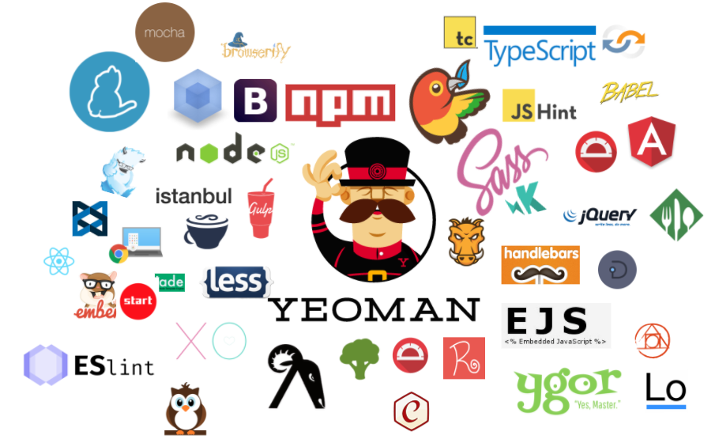

---


---

## Stop Opening the Hood

- 각각의 도구 사용법과 각종 플러그인과 의존성 패키지의 버전 충돌로 파편화가 심해짐
- 오버-툴링이 뉴비들의 러닝커브를 급상승 시킴. [2016년에 자바스크립트를 배우는 기분](https://goo.gl/nAzzkC)
- 점차 프레임워크에서 자체적으로 개발, 구성한 도구 제공
	- React: [create-react-app](https://github.com/facebookincubator/create-react-app)
	- AngularJS 2: [Angular CLI](https://cli.angular.io/)
	- Polymer: [Polymer CLI](https://www.polymer-project.org/1.0/docs/tools/polymer-cli) 
	- Vue.js: [Vue CLI](https://github.com/vuejs/vue-cli)
- 사용되는 툴들의 종류, 버전 그리고 플러그인을 직접관리 -> 프레임워크 레벨에서 주도권을 가지고 관리가능
- 생성된 프로젝트에선 npm scripts 로 사용 -> node 환경에서 일관되고 쉬운 사용법
- 하지만 뚜껑을 열면?

---

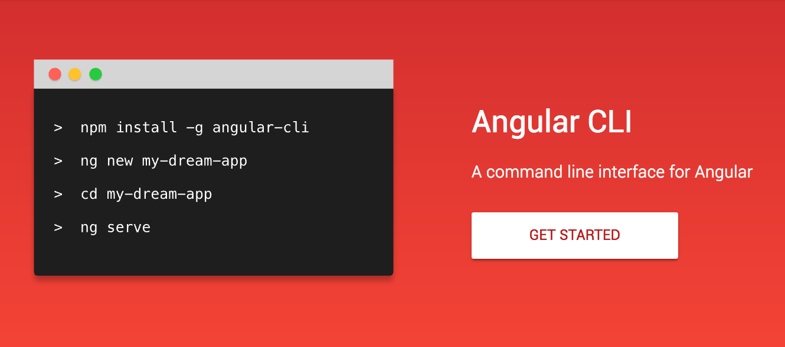

---


```sh
npm install -g polymer-cli

mkdir my-app && cd my-app
polymer init
polymer serve --open
```

---


```sh
npm install -g vue-cli

# init with webpack template
vue init webpack my-app

cd my-app
yarn install
yarn run dev
```

---

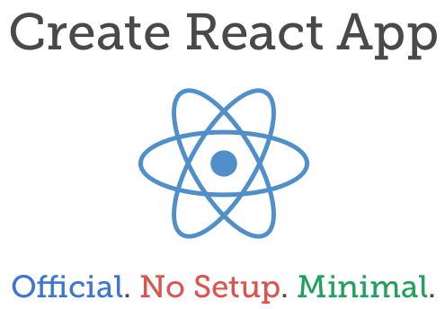

```sh
npm install -g create-react-app

create-react-app my-app
cd my-app/
npm start
```
---

### Fetching Open API with React.js

```js
// src/App.js
import React, { Component } from 'react';

class App extends Component {
  constructor() {
    super(...arguments);
    this.state = { userId: this.props.userId || 'Loading...' };
  }

  componentDidMount() {
    fetch('http://localhost:8080/users/ragingwind')
      .then(res => res.json())
      .then(userId => this.setState(userId))
      .catch(err => console.log(err));
  }

  render() { return (<h2>User ID: {this.state.userId}</h2>) }
}

export default App;
```

---


## Node Packages

- node 의 시작과 끝은 npm (with cli)
- 수십가지의 도구들이 npm 으로 제공
- [신망](https://npm-stat.com/charts.html?author=sindresorhus)있고 유지보수(contribution)가 잘 되고 사용자가 많은(like) 모듈을 사용
- Javascript 개발을 위한 도구(shell script)도 Javascript 로 개발

---


## Shell Script with Node

```js
#!/usr/bin/env node

// parse argument and options
const argv = process.argv.slice(2);

do_work(argv);

// optional, if no job in task
// prevent to process exit immediately
process.stdin.resume();
```

---


## Publishing Your Node Package for All

- [누구든지](https://www.npmjs.com/~ragingwind), [어떤](https://www.npmjs.com/package/daum) node package 든 publish 가능. 대박나거나 꾸준하다면 [랭킹도](http://rankedin.kr/users)
- 재사용성이 높거나 유용한 모듈, 도구들을 제작 배포할 수 있는 플랫폼
- 압도적 숫자의 패키지, 자유스러운 리인벤트-휠(YAFS) 문화

---


### Making your first npm package

- 준비물: github 계정과 리퍼지토리, [npm 개발자 등록](https://docs.npmjs.com/misc/developers#create-a-user-account)

```sh
# making directory
mkdir [YOURID] && cd [YOURID]

# creat and code up at index.js
touch index.js && touch test.js

# init project and input  `package name`, `main`, git address, and more
npm init

# git init, commit and push
git init && git remote add origin [YOUR-REPO]
git add -A && git commit -a -m 'init' && git push origin master

# publish (or version up)
npm publish
```

---


## Protips: Yeoman [generator-nm](https://github.com/sindresorhus/generator-nm)

```sh
# Install with yeoman
npm install --g yo generator-nm

# Scaffolding node module with cli option
yo nm --cli
```

---

# Node for Desktop Application

- UI 를 브라우저 렌더러에 의존하는 하이브리드 node 어플리케이션
- 시스템 콜은 node 에서 어플리케이션은 웹앱으로
- 크로스 플랫폼 지원
- 많은 시도들, 남은 건 nw.js 와 Electron

---


- 깃허브에서 만든 크로스 플랫폼 데스크탑 어플리케이션 개발을 위한 프레임웍
- node, 웹 관련 기술을 모두 사용가능
- 크로스 플랫폼 지원, Auto update, App store, ARM device 와 플랫폼 기능들 추가 중
- 오픈소스, 훌륭한 에코 시스템[[1]](https://github.com/electron-userland), [[2]](https://github.com/sindresorhus/awesome-electron)과 [활발한 개발](https://github.com/electron/electron/graphs/contributors)
	- Latest Chromium and Node
- npm 패키지 (거의 대부분) 그대로 사용가능
- 개발되는 많은 사용/오픈 [어플리케이션들](http://electron.atom.io/apps/), Atom, Slack, VSCode, Wordpress 등
- 개발도구 지원이 훌륭 [Devtron](http://electron.atom.io/devtron/)(Debug), [Spectron](http://electron.atom.io/spectron/)(Test)

---


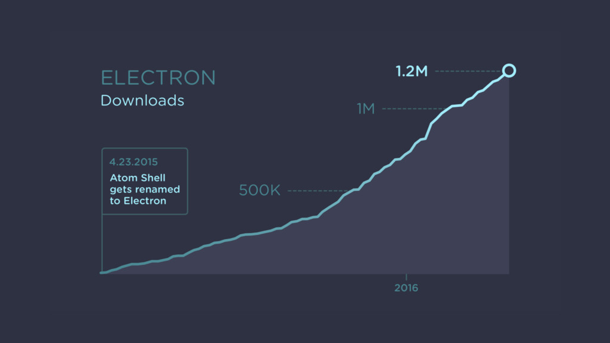

---


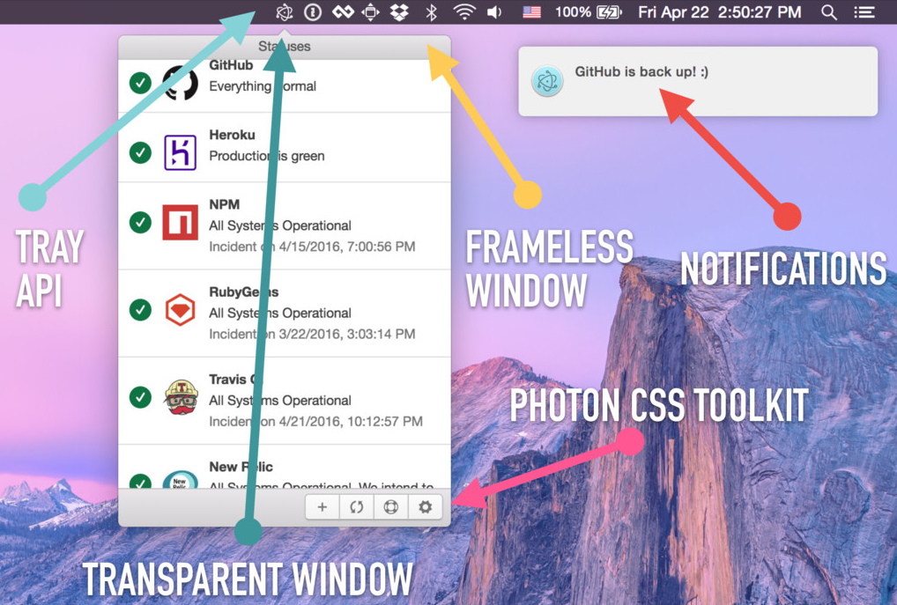

---


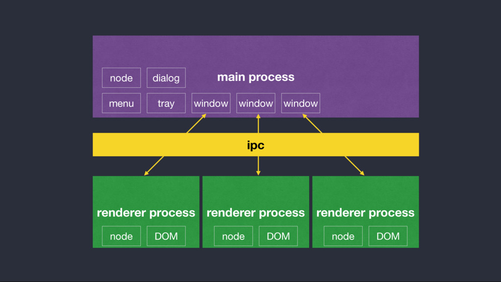

---


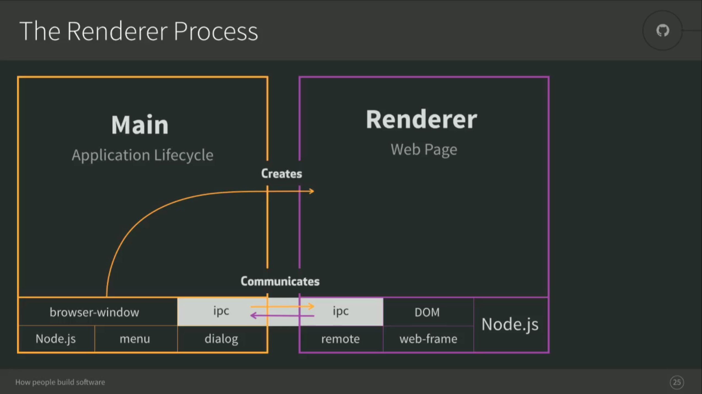

---


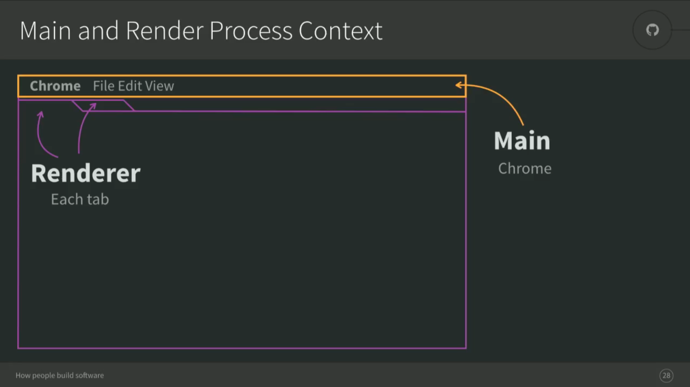


---


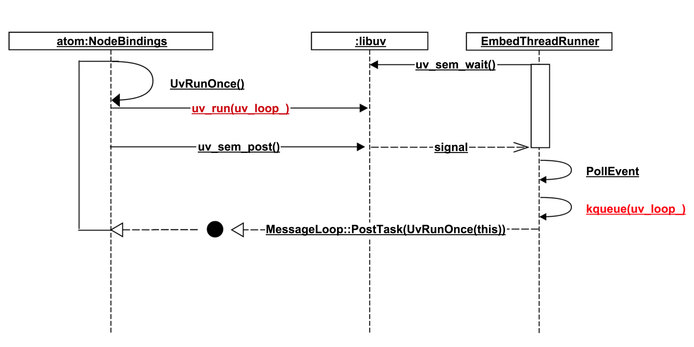

---


[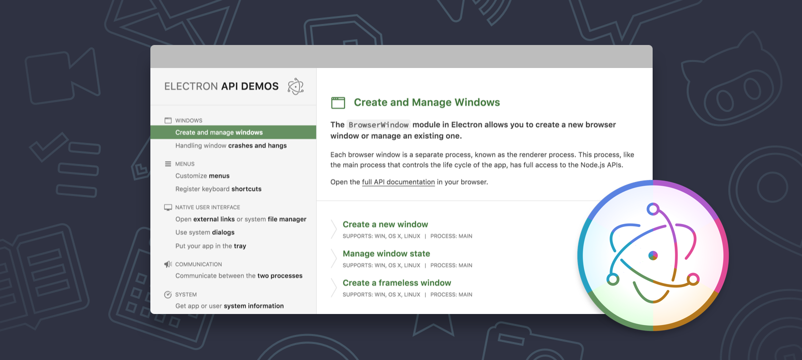](https://github.com/electron/electron-api-demos)

or [electron-quick-start: Clone to try a simple Electron app](https://goo.gl/xV0Vn1)

---

## Hello! Electron

1. Setup the project
    ```sh
    # setup project and install prebuilt electron.
    yarn init && yarn add --dev electron
    ```

1. Configure package.json
    ```js
    {
        ...
        "main": "main.js"
        "scripts": {"start" : "electron ."}
    }
    ```
  
---

3. main.js, for main process
    ```js
    const {app, BrowserWindow} = require('electron');
    let mainWindow;

    app.on('ready', () => {
      mainWindow = new BrowserWindow({ width: 800, height: 600 });
      mainWindow.loadURL(`file://${__dirname}/index.html`);
      mainWindow.on('closed', () => { mainWindow = null });
    });

    app.on('window-all-closed', () => {
      if (process.platform !== 'darwin') { app.quit() }
    });
    ```

4. index.html, for main view in renderer. and say Hello
	```html
    <h1>Hello!<h1>
    <ul id="files"></ul>
    <script type="text/javascript" src="rendere.js"></script>
    ```
---

5. renderer.js, for browser process
    ```js
    const fs = require('fs');

    fs.readdir('.', (err, files) => {
      const ul = document.querySelector('#files');
      ul.innerHTML = files.map(f => {
        return `<li>${f}</li>`;
      }).join('\n');
    });
    ```
6. run electron
	```sh
    yarn start
    ```
---


- Setup the project
```sh
# setup project and install prebuilt electron.
yarn init && yarn add --dev electron
```

- Configure package.json
```js
{
	...
	"main": "main.js"
	"scripts": {"start" : "electron ."}
}
```

---


## Protips: Yeoman [generator-electron](https://github.com/sindresorhus/generator-electron)

```sh
# Install with yeoman
npm install --global yo generator-electron

# Scaffolding electron app
yo electron
```

---

# Node for IoT (BLE)


---

## IoT Device Platforms for Node

### Programmed by Node/JS

- [Johnny-Five](https://goo.gl/t9uUZX), for [Arduino](https://goo.gl/XjtYFB) and [rwaldron/particle-io](https://goo.gl/mG3xTE)
- [Cylon.js](https://goo.gl/z5LwbC)
- [Particle](https://goo.gl/QFMwE3)

### Node/JS runtime on board (H/W)

- [Intel® Edison](https://goo.gl/C2uf85)
- [alooh.io](https://goo.gl/9vAPwy) with [Demo](https://goo.gl/OulZSb)
- [Ruff](https://goo.gl/jbaiZN)
- [IoT.js - Samsung](https://goo.gl/VcuL0X) powered by [JerryScript](https://goo.gl/myz87b)

---

## BLE (Bluetooth 4.x, Bluetooth Low Energy)

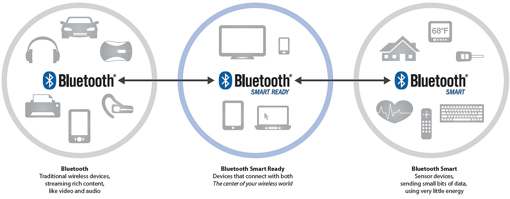

---

## BLE (Bluetooth 4.x, Bluetooth Low Energy)

- 저전력 무선 통신, Bluetooth Smart Ready, Smart, ~~Classic~~ 로 구분
- 최근 스펙은 4.2, Low-power IP(IPv6/LoWPAN) / Gateway for HTTP Proxy for RESTful
- Advertise: 특정 디바이스를 지정하지 않고 적은 바이트(31 byte)를 일정 인터벌 동안 주변 디바이스에게 시그널 방송(Broadcast), Advertiser 와 Observer 로 구분
- Connection: Central 과 Peripheral 사이에 1:1 연결을 맺어 데이터를 타이밍에 맞게 전송
- GATT (Generic Attribute Profile): BLE 데이터 커뮤니케이션을 담당, Read, Write 를 지원
- RSSI (Received Signal Strength Indication): 수신 신호의 (총) 세기 (dBm)

---

## Beacon

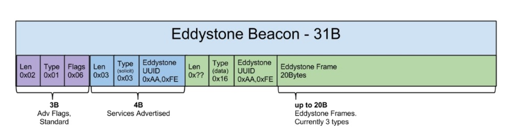

- 별도의 Advertising 데이터 타입(프로토콜), UUID와 그외 커스텀 헤더
- paring / bonding 을 생략하고 Advertising pacaket 으로 특정 데이터(url 등) 전송
- iBeacon(Apple), Eddystone(Google), Facebook Beacon(도 있었음), SKP Syrup (도 뿌렸음)

---

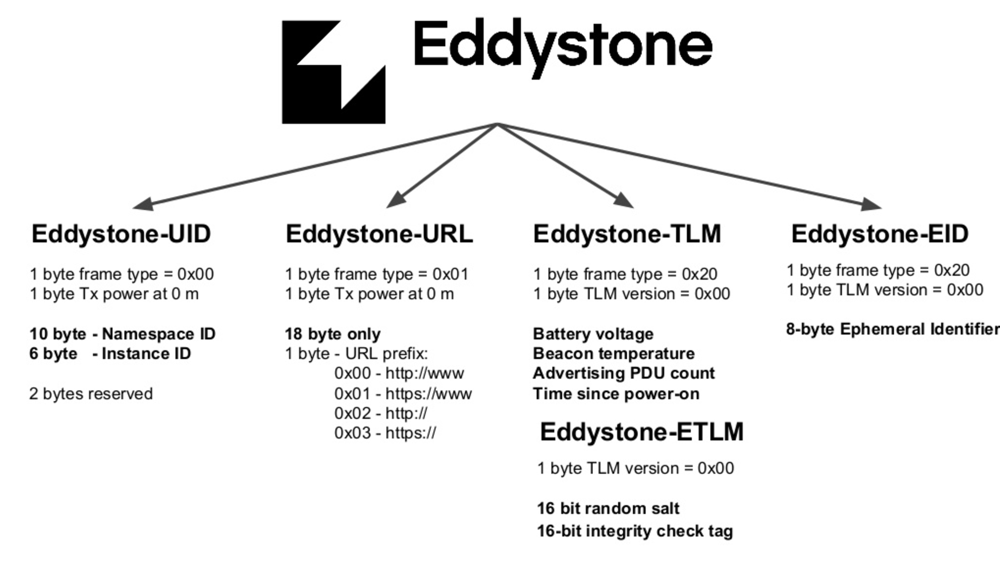

---

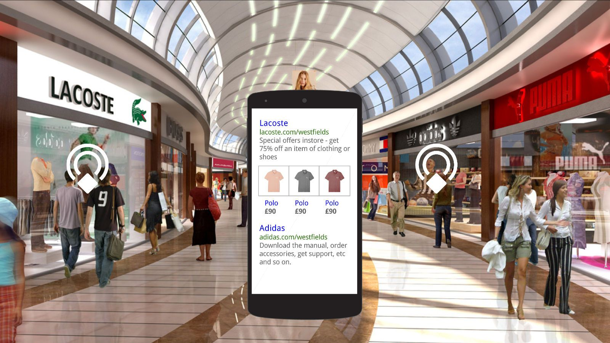

---

[](https://github.com/sandeepmistry)


### Node for Beacon

- [sandeepmistry/bleno: A Node.js module for BLE peripherals](https://goo.gl/J3qFMg)
- [sandeepmistry/node-bleacon: A Node.js library for iBeacons](https://goo.gl/uv0O0u)
- [sandeepmistry/node-eddystone-beacon-scanner: Scanning Eddystone beacons using Node.js](https://goo.gl/xijgSk)
- [don/node-eddystone-beacon: Create an Eddystone Beacon using Node.js](https://goo.gl/jdhqdm)

---


### Eddystone Advertising with [eddystone-beacon-emulator](https://goo.gl/XxMBY3)

```sh
# install
npm install -g eddystone-beacon-emulator

# advertising
eddystone-beacon-emulator --uri=http://goo.gl/eddystone
```
---

### Eddystone Scanning with [eddystone-beacon-scanner](https://github.com/sandeepmistry/node-eddystone-beacon-scanner)

```js
const EddystoneBeaconScanner = require('eddystone-beacon-scanner');

EddystoneBeaconScanner.on('found', function(beacon) {
  console.log('found Eddystone Beacon:\n', JSON.stringify(beacon, null, 2));
});

EddystoneBeaconScanner.on('updated', function(beacon) {
  console.log('updated Eddystone Beacon:\n', JSON.stringify(beacon, null, 2));
});

EddystoneBeaconScanner.on('lost', function(beacon) {
  console.log('lost Eddystone beacon:\n', JSON.stringify(beacon, null, 2));
});

EddystoneBeaconScanner.startScanning(true);
```

---

# Fin